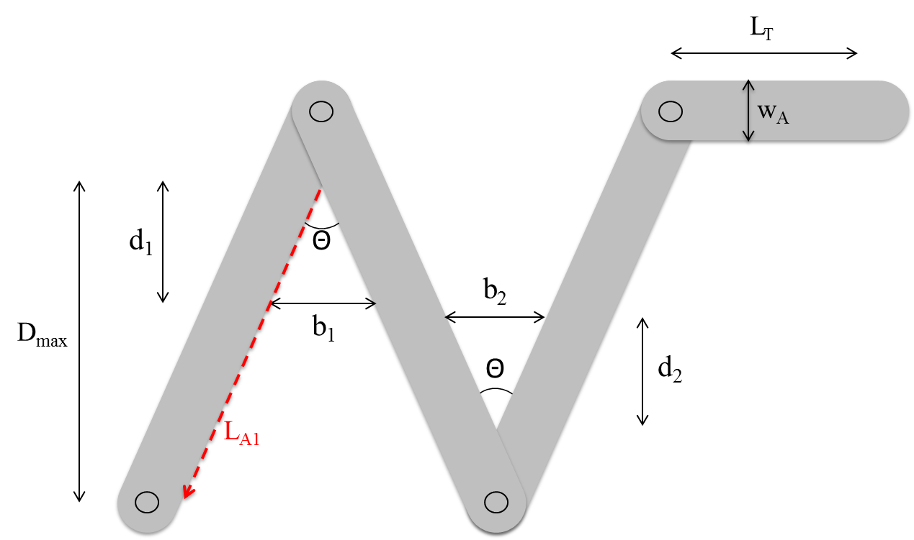

```{r}
# Load libraries
# Load libraries
if (!require(pacman))
  install.packages("pacman")

p_load("ggplot2", "cowplot", "dplyr", "RColorBrewer", "viridis", "DEoptim")
p_load_gh("swarm-lab/projectOptimalBridge")

# Create pretty colorblind friendly palette
cbf <- brewer.pal(8, "Dark2")
```

First density function to be optmized: asymmetric configuration.


Equations:

$\begin{align}\rho &= \frac{N - \frac{n_{b}}{\alpha}}{f}, \\N & = \text{foraging density}(L_{T} + L_{A}), \\L_{A} &= L_{A,S} + L_{A,L}, \\L_{A,S} &= L_{S,0} - \frac{w_{A}}{2}\cot\left(\frac{\theta+\phi}{2} \right), \\L_{A,L} &= L_{L,0} - \frac{w_{A}}{2}\cot\left(\frac{\theta+\phi}{2} \right), \\n_{b} &=  \frac{w_{\Omega}\left(1 - w_{\Omega}\tan\left(\frac{\theta + \phi}{2} \right) \right)}{l_{n}w_{n}}b^{2}, \\b^{2} &= \left(\frac{L_{A,S}}{D_{\text{max},1}}d_{1} \right)^{2} + \left(\frac{L_{A,L}}{D_{\text{max},2}}d_{2} \right)^{2} - 2 d_{1}d_{2}\frac{L_{A,S}L_{A,L}\cos(\theta + \phi)}{D_{\text{max},1}D_{\text{max},2}}, \\D_{\text{max},1} &= L_{A,S}\cos(\theta),  \\D_{\text{max},2} &= L_{A,L}\cos(\phi).\end{align}$

With parameters $L_{T} = 100$, $L_{S,0} = 22$, $L_{L,0} = 44$, $\alpha = 17.02$, $w_{\Omega} = 4.799(\theta + \phi)^{-0.5014}$, $l_{n} = 0.691$, $w_{n} = 0.107$, and $\text{foraging density} = 2.2$.

R code for asymmetric configuration density function is contained in skew_density_general.R. 


Implement optimization routine on asymmetric density function. 

```{r}

contDE <- DEoptim.control(trace=FALSE)

###### Optimization for skew-bridge configuration  ##########################################
angle1 <- seq(5,30,0.5)  # angle in degrees
angle2 <- seq(5,30,0.5)  # angle in degrees
index1 <- seq(1,length(angle1),1)
index2 <- seq(1,length(angle2),1)
LS0 <- 22 # length of left arm (cm)
LL0 <- 44 # length of right arm (cm)
wA <- 3.3 # width of appratus (cm)

theta <- matrix(rep(0,length(angle1)*length(angle2)),nrow=length(angle1),ncol=length(angle2))
phi <- matrix(rep(0,length(angle1)*length(angle2)),nrow=length(angle1),ncol=length(angle2))
D1 <- matrix(rep(0,length(angle1)*length(angle2)),nrow=length(angle1),ncol=length(angle2))
D2 <- matrix(rep(0,length(angle1)*length(angle2)),nrow=length(angle1),ncol=length(angle2))
d1 <- matrix(rep(0,length(angle1)*length(angle2)),nrow=length(angle1),ncol=length(angle2))
d2 <- matrix(rep(0,length(angle1)*length(angle2)),nrow=length(angle1),ncol=length(angle2))

for (m in index1){
  for (n in index2){

    LAS <- LS0 - 0.5*wA/tan(0.5*pi/180*(angle1[m] + angle2[n])) # (cm)
    LAL <- LL0 - 0.5*wA/tan(0.5*pi/180*(angle1[m] + angle2[n])) # (cm)
    Dmax1 <- LAS*cos(pi/180*angle1[m]) # maximum left distance from appex (cm)
    Dmax2 <- LAL*cos(pi/180*angle2[n]) # maximum right distance from appex (cm)

    skew.to.optim <- function(d){

      y <- -1.0*skew_density_general(d,angle1[m],angle2[n],LS0=LS0,LL0=LL0,wA=wA)
      return(y)
    }

    skew.opt.result <- DEoptim(skew.to.optim,lower=c(0,0),upper=c(Dmax1,Dmax2),control = contDE)
    p <- as.numeric(skew.opt.result$optim$bestmem)
    theta[m,n] <- angle1[m]
    phi[m,n] <- angle2[n]
    D1[m,n] <- Dmax1
    D2[m,n] <- Dmax2
    d1[m,n] <- p[1]
    d2[m,n] <- p[2]
  }
}

theta <- as.vector(theta)
phi <- as.vector(phi)
sum <- theta + phi
D1 <- as.vector(D1)
D2 <- as.vector(D2)
d1 <- as.vector(d1)
d2 <- as.vector(d2)

skew.results <- data.frame("theta"=theta, "phi"=phi,"sum"=sum,"Dmax1"=D1,"Dmax2"=D2,"d1"=d1,"d2"=d2)
write.table(skew.results, file = "skewResults.csv", sep = ",",qmethod = "double")


```

Process data. 

```{r}

skew.Results.Data <- read.table("skewResults.csv", header = TRUE, sep = ",")

###  Get figures for skew-bridge results

# Case 1: left-angle = 10 degrees
t10.Pvary <- filter(skew.Results.Data, theta == 10)
#View(t10.Pvary)

x <- t10.Pvary$sum
y <- t10.Pvary$d1 - t10.Pvary$d2

# Casew 2: left-angle = 20 degress
t20.Pvary <- filter(skew.Results.Data, theta == 20)
#View(t20.Pvary)

u <- t20.Pvary$sum
v <- t20.Pvary$d1 - t20.Pvary$d2
```

Show results:

```{r, echo=FALSE}
plot(x,y,type="l",col=4,main="L-R-Difference per Total Angle",xlab="theta(=10) + phi, (degrees)",ylab="(d1-d2), (cm)",lwd=3,xlim = c(15,40),ylim = c(-1,1))
abline(a = 0, b = 0, lty = 2, lwd = 1 )

```

```{r, echo=FALSE}
plot(u,v,type="l",col=4,main="L-R-Difference per Total Angle",xlab="theta(=20) + phi, (degrees)",ylab="(d1-d2), (cm)",lwd=3,xlim = c(25,50),ylim = c(-3,1))
abline(a = 0, b = 0, lty = 2, lwd = 1 )
```


Qualitative summary of restuls for aoptimal bridge positioning in asymmetric configution:


Second density function to be optmized: symmetric two-apex configuration.



Equations:

$\begin{align}\rho &= \frac{ N - \frac{n_{b_{1}}}{\alpha} - \frac{n_{b_{2}}}{\alpha}}{f}, \\N & = \text{foraging density}(L_{T} + L_{A}), \\L_{A} &= L_{A_{1}} + L_{A_{3}} + L_{A_{3}}, \\L_{A_{1}}&=L_{A_{2}} = L_{A_{3}} = L_{0} - \frac{w_{A}}{2}\cot\left(\frac{\theta}{2}\right), \\n_{b_{i}}& = \frac{w_{\theta}\left(1 - w_{\theta}\tan\left(\frac{\theta}{2} \right) \right)}{l_{n}w_{n}}b_{i}^{2}, \  \  i = 1,2, \\b_{i} &= 2d_{i}\tan\left(\frac{\theta}{2} \right) , \  \  i = 1,2, \\f &= L_{T} +  \left(1 - \frac{d_{1}}{D_{\text{max}}} \right)L_{A_{1}} + \left(1 - \frac{d_{2}}{D_{\text{max}}} \right)L_{A_{3}}  \nonumber \\&+  \left| \frac{D_{\text{max}} - d_{1}}{\cos\left(\frac{\theta}{2} \right)} -  \frac{ d_{2}}{\cos\left(\frac{\theta}{2} \right)}\right| + b_{1} + b_{2}, \\D_{\text{max}} &= \frac{L_{A}}{3}\cos\left(\frac{\theta}{2} \right).\end{align}$

With parameters $L_{T} = 100$, $L_{0} = 22$, $\alpha = 17.02$, $w_{\theta} = 4.799(\theta)^{-0.5014}$, $l_{n} = 0.691$, $w_{n} = 0.107$, and $\text{foraging density} = 2.2$.


R code for symmetric two-apex density function. 


Implement optimization routine for symmetric two-bridge configuration density function.

```{r}
contDE <- DEoptim.control(trace=FALSE)

###### Optimization for two-bridge configuration #################################################
angle <- seq(10,60,0.5)   # angle in degrees
index <- seq(1,length(angle),1)
L0 <- 22 # length of an arm (cm)
wA <- 3.3 # width of appratus (cm)
LAi <- L0 - 0.5*wA/tan(0.5*pi/180*angle) # (cm)
Dmax <- LAi*cos(0.5*pi/180*angle)
d1 <- rep(0,length(index))
d2 <- d1

for (m in index){

  two.to.optim <- function(d){

    y <- -1.0*two_density_general(d,angle[m],L0=L0,wA=wA)
    return(y)
  }

  two.opt.result <- DEoptim(two.to.optim,lower=rep(0,2),upper=rep(Dmax[m],2),control = contDE)
  p <- as.numeric(two.opt.result$optim$bestmem)
  d1[m] <- p[1]
  d2[m] <- p[2]
}

two.results <- data.frame("Angle" = angle, "Dmax" = Dmax, "d1" = d1, "d2" = d2)
write.table(two.results, file = "twoResults.csv", sep = ",",qmethod = "double")

```


Process data. 

```{r}
two.Results.Data <- read.table("twoResults.csv", header = TRUE, sep = ",")

two.midDist <- mid_dist(d1,d2,pi/180*angle,Dmax)


```

```{r, echo=FALSE}
g1 <- ggplot()
g1 <- g1 + geom_line(data=two.Results.Data,aes(x=Angle,y=Dmax,color='Dmax'),lwd=2,lty=1)
g1 <- g1 + geom_line(data=two.Results.Data,aes(x=Angle,y=d1,color='d1,d2'),lwd=2,lty=2)
g1 <- g1 + geom_line(data=two.Results.Data,aes(x=Angle,y=two.midDist,color='Mid-dist'),lwd=2,lty=4)
g1 <- g1 + labs(x = "angle (degrees)")
g1 <- g1 + labs(y = "cm")
g1 <- g1 + ggtitle("Symmetric Two-Bridge Apparatus")

g1

```

Qualitative summary of results for optimal bridge positioning for two-apex configuration:


Third density function to be optmized: symmetric three-apex configuration.


Equations:

$\begin{align}\rho &= \frac{ N - \frac{n_{b_{1}}}{\alpha} - \frac{n_{b_{2}}}{\alpha} - \frac{n_{b_{3}}}{\alpha}}{f}, \\N & = \text{foraging density}(L_{T} + L_{A}), \\L_{A} &= L_{A_{1}} + L_{A_{3}} + L_{A_{3}} + L_{A_{4}}, \\L_{A_{1}}&=L_{A_{2}} = L_{A_{3}} = L_{A_{4}} = L_{0} - \frac{w_{A}}{2}\cot\left(\frac{\theta}{2}\right), \\n_{b_{i}}& = \frac{w_{\theta}\left(1 - w_{\theta}\tan\left(\frac{\theta}{2} \right) \right)}{l_{n}w_{n}}b_{i}^{2}, \  \  i = 1,2,3, \\b_{i} &= 2d_{i}\tan\left(\frac{\theta}{2} \right) , \  \  i = 1,2,3, \\f &= L_{T} +  \left(1 - \frac{d_{1}}{D_{\text{max}}} \right)L_{A_{1}} + \left(1 - \frac{d_{3}}{D_{\text{max}}} \right)L_{A_{4}}  \nonumber \\&+  \left| \frac{D_{\text{max}} - d_{1}}{\cos\left(\frac{\theta}{2} \right)} -  \frac{ d_{2}}{\cos\left(\frac{\theta}{2} \right)}\right| +  \left| \frac{D_{\text{max}} - d_{2}}{\cos\left(\frac{\theta}{2} \right)} -  \frac{ d_{3}}{\cos\left(\frac{\theta}{2} \right)}\right| \nonumber \\&+ b_{1} + b_{2} + b_{3}, \\D_{\text{max}} &= \frac{L_{A}}{4}\cos\left(\frac{\theta}{2} \right).\end{align}$

With parameters $L_{T} = 100$, $L_{0} = 22$, $\alpha = 17.02$, $w_{\theta} = 4.799(\theta)^{-0.5014}$, $l_{n} = 0.691$, $w_{n} = 0.107$, and $\text{foraging density} = 2.2$.

R code for symmetric three-apex configuration density function. 


Implement optimization routine for symmetric three-apex configuration density function. 

```{r}
contDE <- DEoptim.control(trace=FALSE)

###### Optimization for three-bridge configuration #################################################
angle <- seq(10,60,0.5)  # angle in degrees
index <- seq(1,length(angle),1)
L0 <- 22 # length of an arm (cm)
wA <- 3.3 # width of appratus (cm)
LAi <- L0 - 0.5*wA/tan(0.5*pi/180*angle) # (cm)
Dmax <- LAi*cos(0.5*pi/180*angle)
d1 <- rep(0,length(index))
d2 <- d1
d3 <- d1

for (m in index){

  three.to.optim <- function(d){

    y <- -1.0*three_density_general(d,angle[m],L0=L0,wA=wA)
    return(y)
  }

  three.opt.result <- DEoptim(three.to.optim,lower=rep(0,3),upper=rep(Dmax[m],3),control = contDE)
  p <- as.numeric(three.opt.result$optim$bestmem)
  d1[m] <- p[1]
  d2[m] <- p[2]
  d3[m] <- p[3]
}

three.results <- data.frame("Angle" = angle, "Dmax" = Dmax, "d1" = d1, "d2" = d2, "d3" = d3)
write.table(three.results, file = "threeResults.csv", sep = ",",qmethod = "double")

```

Process data. 

```{r}
three.Results.Data <- read.table("threeResults.csv", header = TRUE, sep = ",")

three.midtDist1 <- mid_dist(d1,d2,pi/180*angle,Dmax)
three.midtDist2 <- mid_dist(d2,d3,pi/180*angle,Dmax)

```


Show results. 
```{r, echo=FALSE}
g3 <- ggplot()
g3 <- g3 + geom_line(data=three.Results.Data,aes(x=Angle,y=three.midtDist1,color='Mid Dist 1'),lwd=2,lty=1)
g3 <- g3 + geom_line(data=three.Results.Data,aes(x=Angle,y=three.midtDist2,color='Mid Dist 2'),lwd=2,lty=2)
g3 <- g3 + labs(x = "angle (degrees)")
g3 <- g3 + labs(y = "cm")
g3 <- g3 + ggtitle("Distance between Left/Mid, and Mid/Right Bridges")
g3

```


```{r, echo=FALSE}
g4 <- ggplot()
g4 <- g4 + geom_line(data=three.Results.Data,aes(x=Angle,y=`Dmax`,color='Dmax'),lwd=2,lty=1)
g4 <- g4 + geom_line(data=three.Results.Data,aes(x=Angle,y=`d1`,color='d1 (left)'),lwd=2,lty=2)
g4 <- g4 + geom_line(data=three.Results.Data,aes(x=Angle,y=`d2`,color='d2 (mid)'),lwd=2,lty=3)
g4 <- g4 + geom_line(data=three.Results.Data,aes(x=Angle,y=`d3`,color='d3 (right)'),lwd=2,lty=5)
g4 <- g4 + labs(x = "angle (degrees)")
g4 <- g4 + labs(y = "cm")
g4 <- g4 + ggtitle("Maximum and optimized travel distances for bridge positions")
g4


```


Qualitative summary of results for bridge positioning in three-apex configuration:


