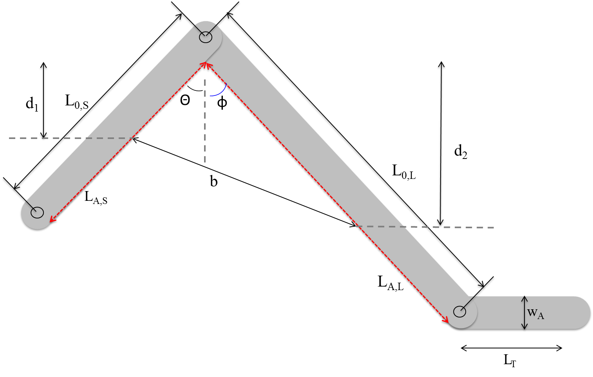
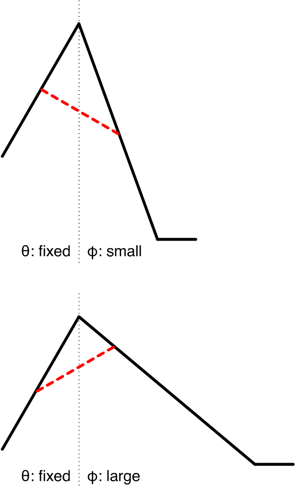
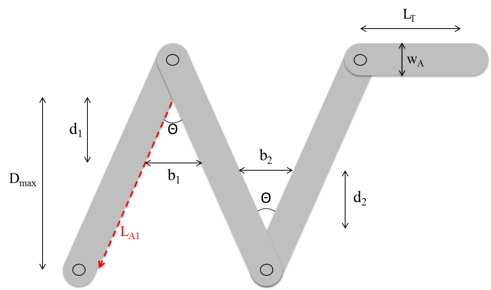
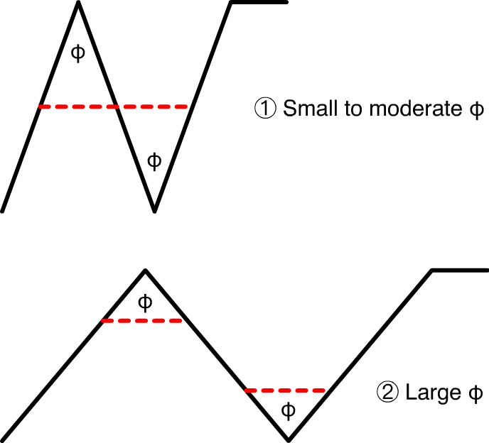
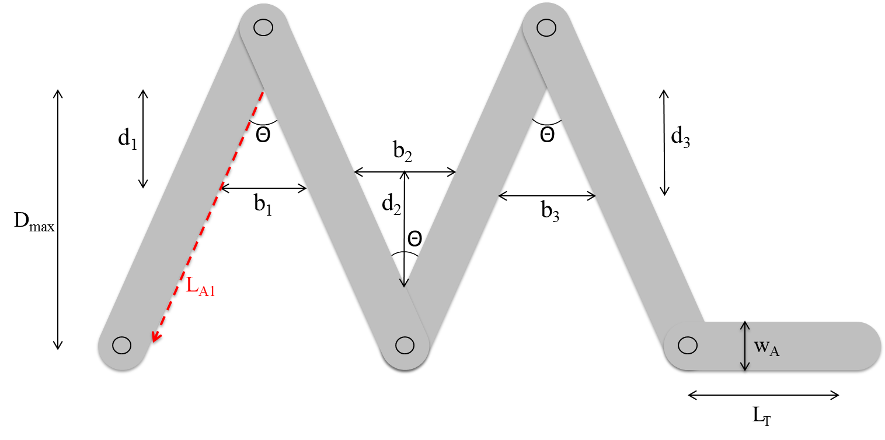
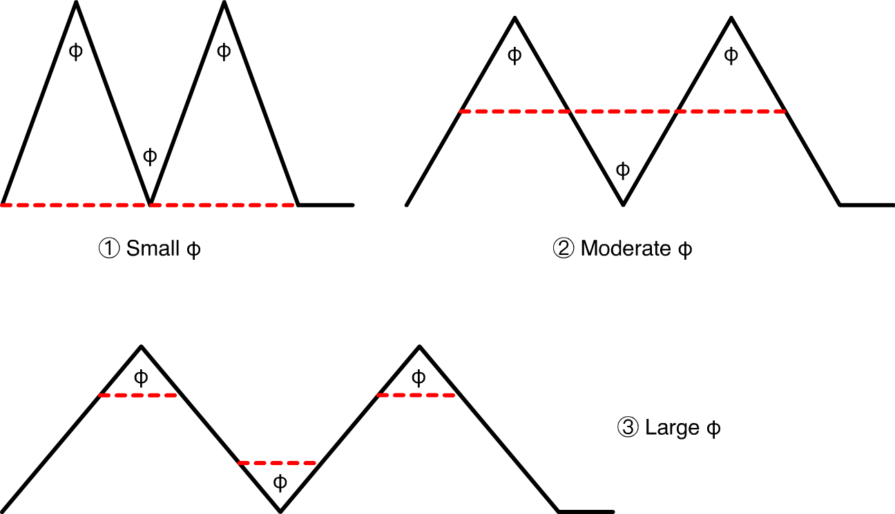

# R setup

```{r, message=FALSE, warning=FALSE}
# Load libraries
if (!require(pacman))
  install.packages("pacman")

p_load("ggplot2", "cowplot", "dplyr", "RColorBrewer", "DEoptim")
p_load_gh("swarm-lab/projectOptimalBridge")

# Create pretty colorblind friendly palette
cbf <- brewer.pal(8, "Dark2")
```

# Asymmetric configuration

## Experimental setup 



## Equations

$\begin{align}\rho &= \frac{N - \frac{n_{b}}{\alpha}}{f}, \\N & = \text{foraging density}(L_{T} + L_{A}), \\L_{A} &= L_{A,S} + L_{A,L}, \\L_{A,S} &= L_{S,0} - \frac{w_{A}}{2}\cot\left(\frac{\theta+\phi}{2} \right), \\L_{A,L} &= L_{L,0} - \frac{w_{A}}{2}\cot\left(\frac{\theta+\phi}{2} \right), \\n_{b} &=  \frac{w_{\Omega}\left(1 - w_{\Omega}\tan\left(\frac{\theta + \phi}{2} \right) \right)}{l_{n}w_{n}}b^{2}, \\b^{2} &= \left(\frac{L_{A,S}}{D_{\text{max},1}}d_{1} \right)^{2} + \left(\frac{L_{A,L}}{D_{\text{max},2}}d_{2} \right)^{2} - 2 d_{1}d_{2}\frac{L_{A,S}L_{A,L}\cos(\theta + \phi)}{D_{\text{max},1}D_{\text{max},2}}, \\D_{\text{max},1} &= L_{A,S}\cos(\theta),  \\D_{\text{max},2} &= L_{A,L}\cos(\phi).\end{align}$

With parameters $L_{T} = 100$, $L_{S,0} = 22$, $L_{L,0} = 44$, $\alpha = 17.02$, $w_{\Omega} = 4.799(\theta + \phi)^{-0.5014}$, $l_{n} = 0.691$, $w_{n} = 0.107$, and $\text{foraging density} = 2.2$.

The R code for the asymmetric configuration density function is contained in `skew_density_general`. 

## Optimization routine

```{r}
if (file.exists("skewResults.csv")) {
  skew.results <- read.csv("skewResults.csv")
} else {
  contDE <- DEoptim.control(trace = FALSE)
  
  ###### Optimization for skew-bridge configuration  ##########################################
  angle1 <- seq(5, 30, 0.5)  # angle in degrees
  angle2 <- seq(5, 30, 0.5)  # angle in degrees
  index1 <- seq(1, length(angle1), 1)
  index2 <- seq(1, length(angle2), 1)
  LS0 <- 22 # length of left arm (cm)
  LL0 <- 44 # length of right arm (cm)
  wA <- 3.3 # width of appratus (cm)
  
  theta <- matrix(rep(0, length(angle1) * length(angle2)), nrow = length(angle1), ncol = length(angle2))
  phi <- matrix(rep(0, length(angle1) * length(angle2)), nrow = length(angle1), ncol = length(angle2))
  D1 <- matrix(rep(0, length(angle1) * length(angle2)), nrow = length(angle1), ncol = length(angle2))
  D2 <- matrix(rep(0, length(angle1) * length(angle2)), nrow = length(angle1), ncol = length(angle2))
  d1 <- matrix(rep(0, length(angle1) * length(angle2)), nrow = length(angle1), ncol = length(angle2))
  d2 <- matrix(rep(0, length(angle1) * length(angle2)), nrow = length(angle1), ncol = length(angle2))
  
  for (m in index1) {
    for (n in index2) {
      
      LAS <- LS0 - 0.5 * wA / tan(0.5 * pi / 180 * (angle1[m] + angle2[n])) # (cm)
      LAL <- LL0 - 0.5 * wA / tan(0.5 * pi/180 * (angle1[m] + angle2[n])) # (cm)
      Dmax1 <- LAS * cos(pi / 180 * angle1[m]) # maximum left distance from appex (cm)
      Dmax2 <- LAL * cos(pi / 180 * angle2[n]) # maximum right distance from appex (cm)
      
      skew.to.optim <- function(d) {
        -1.0 * skew_density_general(d, angle1[m], angle2[n], LS0 = LS0, LL0 = LL0, wA = wA)
      }
      
      skew.opt.result <- DEoptim(skew.to.optim, lower = c(0, 0), upper = c(Dmax1, Dmax2), control = contDE)
      p <- as.numeric(skew.opt.result$optim$bestmem)
      theta[m, n] <- angle1[m]
      phi[m, n] <- angle2[n]
      D1[m, n] <- Dmax1
      D2[m, n] <- Dmax2
      d1[m, n] <- p[1]
      d2[m, n] <- p[2]
    }
  }
  
  theta <- as.vector(theta)
  phi <- as.vector(phi)
  sum <- theta + phi
  D1 <- as.vector(D1)
  D2 <- as.vector(D2)
  d1 <- as.vector(d1)
  d2 <- as.vector(d2)
  
  skew.results <- data.frame("theta" = theta, "phi" = phi, "sum" = sum, "Dmax1" = D1, 
                             "Dmax2" = D2, "d1" = d1, "d2" = d2)
  write.csv(skew.results, file = "skewResults.csv", row.names = FALSE)
}
```

## Results

### Figure 5-a

```{r, fig.height=4, fig.width=6, message=FALSE}
filter(skew.results, theta == 20) %>%
  ggplot(aes(x = theta + phi, y = d1 - d2)) + 
  geom_line(size = 1.5) + 
  geom_hline(yintercept = 0, linetype = 2) +
  ylim(-1, 1) + 
  xlab(expression(paste(theta, "(=20) ", + phi, ", (deg)"))) +
  ylab(expression(paste(d[1] - d[2], ", (cm)"))) + 
  theme_minimal(base_size = 15)
```

```{r, fig.height=4, fig.width=6, message=FALSE}
filter(skew.results, theta == 20) %>%
  ggplot(aes(x = phi, y = d1 - d2)) + 
  geom_line(size = 1.5) + 
  geom_vline(xintercept = 20, linetype = 2) + 
  geom_hline(yintercept = 0, linetype = 2) +
  draw_label(substitute(paste(phi, " = ", theta, " = ", 20~degree)), x = 20, y = 0.25,
             angle = 90, hjust = 0, vjust = -0.25) + 
  ylim(-1, 1) + 
  xlab(expression(paste(phi, " (deg)"))) +
  ylab(expression(paste(d[1] - d[2], ", (cm)"))) + 
  theme_minimal(base_size = 15)
```

### Figure 5-b

```{r, fig.height=4, fig.width=6, message=FALSE}
filter(skew.results, theta == 10) %>%
  ggplot(aes(x = theta + phi, y = d1 - d2)) + 
  geom_line(size = 1.5) + 
  geom_hline(yintercept = 0, linetype = 2) +
  ylim(-1, 1) + 
  xlab(expression(paste(theta, "(=10) ", + phi, ", (deg)"))) +
  ylab(expression(paste(d[1] - d[2], ", (cm)"))) + 
  theme_minimal(base_size = 15)
```

```{r, fig.height=4, fig.width=6, message=FALSE}
filter(skew.results, theta == 10) %>%
  ggplot(aes(x = phi, y = d1 - d2)) + 
  geom_line(size = 1.5) + 
  geom_vline(xintercept = 10, linetype = 2) + 
  geom_hline(yintercept = 0, linetype = 2) +
  draw_label(substitute(paste(phi, " = ", theta, " = ", 10~degree)), x = 10, y = 0.25,
             angle = 90, hjust = 0, vjust = -0.25) + 
  ylim(-1, 1) + 
  xlab(expression(paste(phi, " (deg)"))) +
  ylab(expression(paste(d[1] - d[2], ", (cm)"))) + 
  theme_minimal(base_size = 15)
```

## Interpretation



# Two-apex configuration

## Experimental setup 



## Equations

$\begin{align}\rho &= \frac{ N - \frac{n_{b_{1}}}{\alpha} - \frac{n_{b_{2}}}{\alpha}}{f}, \\N & = \text{foraging density}(L_{T} + L_{A}), \\L_{A} &= L_{A_{1}} + L_{A_{3}} + L_{A_{3}}, \\L_{A_{1}}&=L_{A_{2}} = L_{A_{3}} = L_{0} - \frac{w_{A}}{2}\cot\left(\frac{\theta}{2}\right), \\n_{b_{i}}& = \frac{w_{\theta}\left(1 - w_{\theta}\tan\left(\frac{\theta}{2} \right) \right)}{l_{n}w_{n}}b_{i}^{2}, \  \  i = 1,2, \\b_{i} &= 2d_{i}\tan\left(\frac{\theta}{2} \right) , \  \  i = 1,2, \\f &= L_{T} +  \left(1 - \frac{d_{1}}{D_{\text{max}}} \right)L_{A_{1}} + \left(1 - \frac{d_{2}}{D_{\text{max}}} \right)L_{A_{3}}  \nonumber \\&+  \left| \frac{D_{\text{max}} - d_{1}}{\cos\left(\frac{\theta}{2} \right)} -  \frac{ d_{2}}{\cos\left(\frac{\theta}{2} \right)}\right| + b_{1} + b_{2}, \\D_{\text{max}} &= \frac{L_{A}}{3}\cos\left(\frac{\theta}{2} \right).\end{align}$

With parameters $L_{T} = 100$, $L_{0} = 22$, $\alpha = 17.02$, $w_{\theta} = 4.799(\theta)^{-0.5014}$, $l_{n} = 0.691$, $w_{n} = 0.107$, and $\text{foraging density} = 2.2$.

The R code for the two-apex configuration density function is contained in `two_density_general`. 

## Optimization routine

```{r}
if (file.exists("twoResults.csv")) {
  two.results <- read.csv("twoResults.csv")
} else {
  contDE <- DEoptim.control(trace = FALSE)
  
  ###### Optimization for two-bridge configuration #################################################
  angle <- seq(10, 60, 0.5)   # angle in degrees
  index <- seq(1, length(angle), 1)
  L0 <- 22 # length of an arm (cm)
  wA <- 3.3 # width of appratus (cm)
  LAi <- L0 - 0.5 * wA / tan(0.5 * pi / 180 * angle) # (cm)
  Dmax <- LAi * cos(0.5 * pi / 180 * angle)
  d1 <- rep(0, length(index))
  d2 <- d1
  
  for (m in index) {
    two.to.optim <- function(d) {
      -1.0 * two_density_general(d, angle[m], L0 = L0, wA = wA)
    }
    
    two.opt.result <- DEoptim(two.to.optim, lower = rep(0, 2), upper = rep(Dmax[m], 2), control = contDE)
    p <- as.numeric(two.opt.result$optim$bestmem)
    d1[m] <- p[1]
    d2[m] <- p[2]
  }
  
  two.results <- data.frame("Angle" = angle, "Dmax" = Dmax, "d1" = d1, "d2" = d2)
  write.csv(two.results, file = "twoResults.csv", row.names = FALSE)
}
```

## Results

### Figure 6

```{r, fig.height=4, fig.width=6, message=FALSE}
redat6 <- data.frame(type = "Dmax", angle = two.results$Angle, 
                     val = two.results$Dmax, rel = 1) %>%
  rbind(data.frame(type = "d1, d2", angle = two.results$Angle, 
                   val = two.results$d1, rel = two.results$d1 / two.results$Dmax)) %>%
  rbind(data.frame(type = "Mid-dist", angle = two.results$Angle, 
                   val = two.results$Dmax - two.results$d1 - two.results$d2,
                   rel = (two.results$Dmax - two.results$d1 - two.results$d2) / two.results$Dmax)) 

ggplot(redat6, aes(x = angle, y = val, color = type, linetype = type)) +
  geom_line(size = 1.5) + 
  ylab("Distance (cm)") +
  xlab("Angle (deg)") + 
  scale_color_manual(values = cbf) + 
  theme_minimal(base_size = 15) + 
  theme(legend.title = element_blank(),
        legend.justification = c(0, 1), 
        legend.position = c(0, 1))
```

```{r, fig.height=4, fig.width=6, message=FALSE}
circled_num <- data.frame(x = c((min(redat6$angle) + 37.5) / 2, (37.5 + max(redat6$angle)) / 2),
                          y = -0.075 * max(redat6$val),
                          char = c("1", "2"))

ggplot() +
  geom_rect(aes(xmin = -Inf, xmax = 37.5, ymin = -Inf, ymax = Inf), fill = "#00000025") +
  geom_rect(aes(xmin = 37.5, xmax = Inf, ymin = -Inf, ymax = Inf), fill = "#00000045") +
  geom_line(data = redat6, aes(x = angle, y = val, color = type, linetype = type), size = 1.5) + 
  geom_text(data = circled_num, aes(x = x, y = y, label = char)) + 
  geom_point(data = circled_num, aes(x = x, y = y), shape = 1, size = 5) +
  ylim(-0.1 * max(redat6$val), NA) + 
  ylab("Distance (cm)") +
  xlab("Angle (deg)") + 
  scale_color_manual(values = cbf) + 
  theme_minimal(base_size = 15) + 
  theme(legend.title = element_blank(),
        legend.justification = c(0, 1), 
        legend.position = c(0, 1))
```

```{r, fig.height=4, fig.width=6, message=FALSE}
circled_num <- data.frame(x = c((min(redat6$angle) + 37.5) / 2, (37.5 + max(redat6$angle)) / 2),
                          y = -0.075 * max(redat6$rel),
                          char = c("1", "2"))

ggplot() +
  geom_rect(aes(xmin = -Inf, xmax = 37.5, ymin = -Inf, ymax = Inf), fill = "#00000025") +
  geom_rect(aes(xmin = 37.5, xmax = Inf, ymin = -Inf, ymax = Inf), fill = "#00000045") +
  geom_line(data = filter(redat6, type != "Dmax"), 
            aes(x = angle, y = rel, color = type, linetype = type), size = 1.5) + 
  geom_text(data = circled_num, aes(x = x, y = y, label = char)) + 
  geom_point(data = circled_num, aes(x = x, y = y), shape = 1, size = 5) +
  ylim(-0.1 * max(redat6$rel), NA) + 
  ylab("Distance / Dmax") +
  xlab("Angle (deg)") + 
  scale_color_manual(values = cbf) + 
  theme_minimal(base_size = 15) + 
  theme(legend.title = element_blank(),
        legend.justification = c(0, 1), 
        legend.position = c(0, 1))
```


## Interpretation



# Two-apex configuration

## Experimental setup



## Equations

$\begin{align}\rho &= \frac{ N - \frac{n_{b_{1}}}{\alpha} - \frac{n_{b_{2}}}{\alpha} - \frac{n_{b_{3}}}{\alpha}}{f}, \\N & = \text{foraging density}(L_{T} + L_{A}), \\L_{A} &= L_{A_{1}} + L_{A_{3}} + L_{A_{3}} + L_{A_{4}}, \\L_{A_{1}}&=L_{A_{2}} = L_{A_{3}} = L_{A_{4}} = L_{0} - \frac{w_{A}}{2}\cot\left(\frac{\theta}{2}\right), \\n_{b_{i}}& = \frac{w_{\theta}\left(1 - w_{\theta}\tan\left(\frac{\theta}{2} \right) \right)}{l_{n}w_{n}}b_{i}^{2}, \  \  i = 1,2,3, \\b_{i} &= 2d_{i}\tan\left(\frac{\theta}{2} \right) , \  \  i = 1,2,3, \\f &= L_{T} +  \left(1 - \frac{d_{1}}{D_{\text{max}}} \right)L_{A_{1}} + \left(1 - \frac{d_{3}}{D_{\text{max}}} \right)L_{A_{4}}  \nonumber \\&+  \left| \frac{D_{\text{max}} - d_{1}}{\cos\left(\frac{\theta}{2} \right)} -  \frac{ d_{2}}{\cos\left(\frac{\theta}{2} \right)}\right| +  \left| \frac{D_{\text{max}} - d_{2}}{\cos\left(\frac{\theta}{2} \right)} -  \frac{ d_{3}}{\cos\left(\frac{\theta}{2} \right)}\right| \nonumber \\&+ b_{1} + b_{2} + b_{3}, \\D_{\text{max}} &= \frac{L_{A}}{4}\cos\left(\frac{\theta}{2} \right).\end{align}$

With parameters $L_{T} = 100$, $L_{0} = 22$, $\alpha = 17.02$, $w_{\theta} = 4.799(\theta)^{-0.5014}$, $l_{n} = 0.691$, $w_{n} = 0.107$, and $\text{foraging density} = 2.2$.

The R code for the two-apex configuration density function is contained in `three_density_general`. 

## Optimization routine

```{r}
if (file.exists("threeResults.csv")) {
  three.results <- read.csv("threeResults.csv")
} else {
  contDE <- DEoptim.control(trace = FALSE)
  
  ###### Optimization for three-bridge configuration #################################################
  angle <- seq(10, 60, 0.5)  # angle in degrees
  index <- seq(1, length(angle), 1)
  L0 <- 22 # length of an arm (cm)
  wA <- 3.3 # width of appratus (cm)
  LAi <- L0 - 0.5 * wA / tan(0.5 * pi / 180 * angle) # (cm)
  Dmax <- LAi * cos(0.5 * pi / 180 * angle)
  d1 <- rep(0, length(index))
  d2 <- d1
  d3 <- d1
  
  for (m in index){
    three.to.optim <- function(d) {
      -1.0 * three_density_general(d, angle[m], L0 = L0, wA = wA)
    }
    
    three.opt.result <- DEoptim(three.to.optim, lower = rep(0, 3), upper = rep(Dmax[m], 3), control = contDE)
    p <- as.numeric(three.opt.result$optim$bestmem)
    d1[m] <- p[1]
    d2[m] <- p[2]
    d3[m] <- p[3]
  }
  
  three.results <- data.frame("Angle" = angle, "Dmax" = Dmax, "d1" = d1, "d2" = d2, "d3" = d3)
  write.csv(three.results, file = "threeResults.csv", row.names = FALSE)
}
```

## Results

### Figure 7-a

```{r, fig.height=4, fig.width=6, message=FALSE}
redat7a <- data.frame(type = "Dmax", angle = three.results$Angle, 
                      val = three.results$Dmax, rel = 1) %>%
  rbind(data.frame(type = "d1 (left), d3 (right)", angle = three.results$Angle, 
                   val = three.results$d1, rel = three.results$d1 / three.results$Dmax)) %>%
  rbind(data.frame(type = "d2 (mid)", angle = three.results$Angle, 
                   val = three.results$d2, rel = three.results$d2 / three.results$Dmax)) 

ggplot(redat7a, aes(x = angle, y = val, color = type, linetype = type)) +
  geom_line(size = 1.5) + 
  ylab("Distance (cm)") +
  xlab("Angle (deg)") + 
  scale_color_manual(values = cbf) +   
  theme_minimal(base_size = 15) + 
  theme(legend.title = element_blank(),
        legend.justification = c(0, 1), 
        legend.position = c(0, 1))
```

```{r, fig.height=4, fig.width=6, message=FALSE}
circled_num <- data.frame(x = c((min(redat7a$angle) + 20.5) / 2, 
                                (20.5 + 38) / 2,
                                (38 + max(redat7a$angle)) / 2),
                          y = -0.075 * max(redat7a$val),
                          char = c("1", "2", "3"))

ggplot() +
  geom_rect(aes(xmin = -Inf, xmax = 20.5, ymin = -Inf, ymax = Inf), fill = "#00000025") +
  geom_rect(aes(xmin = 20.5, xmax = 38, ymin = -Inf, ymax = Inf), fill = "#00000035") +
  geom_rect(aes(xmin = 38, xmax = Inf, ymin = -Inf, ymax = Inf), fill = "#00000045") +
  geom_line(data = redat7a, aes(x = angle, y = val, color = type, linetype = type), size = 1.5) + 
  geom_text(data = circled_num, aes(x = x, y = y, label = char)) + 
  geom_point(data = circled_num, aes(x = x, y = y), shape = 1, size = 5) +
  ylim(-0.1 * max(redat7a$val), 1.1 * max(redat7a$val)) +
  ylab("Distance (cm)") +
  xlab("Angle (deg)") + 
  scale_color_manual(values = cbf) +   
  theme_minimal(base_size = 15) + 
  theme(legend.title = element_blank(),
        legend.justification = c(0, 1), 
        legend.position = c(0, 1))
```

```{r, fig.height=4, fig.width=6, message=FALSE}
circled_num <- data.frame(x = c((min(redat7a$angle) + 20.5) / 2, 
                                (20.5 + 38) / 2,
                                (38 + max(redat7a$angle)) / 2),
                          y = -0.075 * max(redat7a$rel),
                          char = c("1", "2", "3"))

ggplot() +
  geom_rect(aes(xmin = -Inf, xmax = 20.5, ymin = -Inf, ymax = Inf), fill = "#00000025") +
  geom_rect(aes(xmin = 20.5, xmax = 38, ymin = -Inf, ymax = Inf), fill = "#00000035") +
  geom_rect(aes(xmin = 38, xmax = Inf, ymin = -Inf, ymax = Inf), fill = "#00000045") +
  geom_line(data = filter(redat7a, type != "Dmax"), 
            aes(x = angle, y = rel, color = type, linetype = type), size = 1.5) + 
  geom_text(data = circled_num, aes(x = x, y = y, label = char)) + 
  geom_point(data = circled_num, aes(x = x, y = y), shape = 1, size = 5) +
  ylim(-0.1 * max(redat7a$rel), NA) +
  ylab("Distance / Dmax") +
  xlab("Angle (deg)") + 
  scale_color_manual(values = cbf) +   
  theme_minimal(base_size = 15) + 
  theme(legend.title = element_blank(),
        legend.justification = c(1, 1), 
        legend.position = c(1, 1))
```

### Figure 7-b

```{r, fig.height=4, fig.width=6, message=FALSE}
redat7b <- data.frame(type = "Mid-dist left", angle = three.results$Angle, 
                      val = three.results$Dmax - three.results$d1 - three.results$d2) %>%
  rbind(data.frame(type = "Mid-dist right", angle = three.results$Angle, 
                   val = three.results$Dmax - three.results$d2 - three.results$d3)) 

ggplot(redat7b, aes(x = angle, y = val, color = type, linetype = type)) +
  geom_line(size = 1.5) + 
  ylab("Distance (cm)") +
  xlab("Angle (deg)") + 
  scale_color_manual(values = cbf) +  
  theme_minimal(base_size = 15) + 
  theme(legend.title = element_blank(),
        legend.justification = c(0, 1), 
        legend.position = c(0, 1))
```

```{r, fig.height=4, fig.width=6, message=FALSE}
circled_num <- data.frame(x = c((min(redat7b$angle) + 20.5) / 2, 
                                (20.5 + 38) / 2,
                                (38 + max(redat7b$angle)) / 2),
                          y = -0.075 * max(redat7b$val),
                          char = c("1", "2", "3"))

ggplot() +
  geom_rect(aes(xmin = -Inf, xmax = 20.5, ymin = -Inf, ymax = Inf), fill = "#00000025") +
  geom_rect(aes(xmin = 20.5, xmax = 38, ymin = -Inf, ymax = Inf), fill = "#00000035") +
  geom_rect(aes(xmin = 38, xmax = Inf, ymin = -Inf, ymax = Inf), fill = "#00000045") +
  geom_line(data = redat7b, aes(x = angle, y = val, color = type, linetype = type), size = 1.5) + 
  geom_text(data = circled_num, aes(x = x, y = y, label = char)) + 
  geom_point(data = circled_num, aes(x = x, y = y), shape = 1, size = 5) +
  ylim(-0.1 * max(redat7b$val), NA) +
  ylab("Distance (cm)") +
  xlab("Angle (deg)") + 
  scale_color_manual(values = cbf) +  
  theme_minimal(base_size = 15) + 
  theme(legend.title = element_blank(),
        legend.justification = c(0, 1), 
        legend.position = c(0, 1))
```

## Interpretation



# Figure 8

## Figure 8a

### Optimization routine

```{r}
if (file.exists("skewResults_0.5.csv")) {
  skewResults_0.5 <- read.csv("skewResults_0.5.csv")
} else {
  contDE <- DEoptim.control(trace = FALSE)
  
  ###### Optimization for skew-bridge configuration  ##########################################
  angle1 <- seq(5, 30, 0.5)  # angle in degrees
  angle2 <- seq(5, 30, 0.5)  # angle in degrees
  index1 <- seq(1, length(angle1), 1)
  index2 <- seq(1, length(angle2), 1)
  LS0 <- 22 # length of left arm (cm)
  LL0 <- 44 # length of right arm (cm)
  wA <- 3.3 # width of appratus (cm)
  
  theta <- matrix(rep(0, length(angle1) * length(angle2)), nrow = length(angle1), ncol = length(angle2))
  phi <- matrix(rep(0, length(angle1) * length(angle2)), nrow = length(angle1), ncol = length(angle2))
  D1 <- matrix(rep(0, length(angle1) * length(angle2)), nrow = length(angle1), ncol = length(angle2))
  D2 <- matrix(rep(0, length(angle1) * length(angle2)), nrow = length(angle1), ncol = length(angle2))
  d1 <- matrix(rep(0, length(angle1) * length(angle2)), nrow = length(angle1), ncol = length(angle2))
  d2 <- matrix(rep(0, length(angle1) * length(angle2)), nrow = length(angle1), ncol = length(angle2))
  
  for (m in index1) {
    for (n in index2) {
      
      LAS <- LS0 - 0.5 * wA / tan(0.5 * pi / 180 * (angle1[m] + angle2[n])) # (cm)
      LAL <- LL0 - 0.5 * wA / tan(0.5 * pi/180 * (angle1[m] + angle2[n])) # (cm)
      Dmax1 <- LAS * cos(pi / 180 * angle1[m]) # maximum left distance from appex (cm)
      Dmax2 <- LAL * cos(pi / 180 * angle2[n]) # maximum right distance from appex (cm)
      
      skew.to.optim <- function(d) {
        -1.0 * skew_density_general(d, angle1[m], angle2[n], ant.dens = 0.5, LS0 = LS0, LL0 = LL0, wA = wA)
      }
      
      skew.opt.result <- DEoptim(skew.to.optim, lower = c(0, 0), upper = c(Dmax1, Dmax2), control = contDE)
      p <- as.numeric(skew.opt.result$optim$bestmem)
      theta[m, n] <- angle1[m]
      phi[m, n] <- angle2[n]
      D1[m, n] <- Dmax1
      D2[m, n] <- Dmax2
      d1[m, n] <- p[1]
      d2[m, n] <- p[2]
    }
  }
  
  theta <- as.vector(theta)
  phi <- as.vector(phi)
  sum <- theta + phi
  D1 <- as.vector(D1)
  D2 <- as.vector(D2)
  d1 <- as.vector(d1)
  d2 <- as.vector(d2)
  
  skewResults_0.5 <- data.frame("theta" = theta, "phi" = phi, "sum" = sum, "Dmax1" = D1, 
                             "Dmax2" = D2, "d1" = d1, "d2" = d2)
  write.csv(skewResults_0.5, file = "skewResults_0.5.csv", row.names = FALSE)
}
```

### Results

```{r, fig.height=4, fig.width=6, message=FALSE}
filter(skewResults_0.5, theta == 20) %>%
  ggplot(aes(x = phi, y = d1 - d2)) + 
  geom_line(size = 1.5) + 
  geom_vline(xintercept = 20, linetype = 2) + 
  geom_hline(yintercept = 0, linetype = 2) +
  draw_label(substitute(paste(phi, " = ", theta, " = ", 20~degree)), x = 20, y = -2,
             angle = 90, hjust = 0, vjust = -0.25) + 
  ylim(-2.5, 1) + 
  xlab(expression(paste(phi, " (deg)"))) +
  ylab(expression(paste(d[1] - d[2], ", (cm)"))) + 
  theme_minimal(base_size = 15)
```

## Figure 8b

### Optimization routine

```{r}
if (file.exists("skewResults_5.csv")) {
  skewResults_5 <- read.csv("skewResults_5.csv")
} else {
  contDE <- DEoptim.control(trace = FALSE)
  
  ###### Optimization for skew-bridge configuration  ##########################################
  angle1 <- seq(5, 30, 0.5)  # angle in degrees
  angle2 <- seq(5, 30, 0.5)  # angle in degrees
  index1 <- seq(1, length(angle1), 1)
  index2 <- seq(1, length(angle2), 1)
  LS0 <- 22 # length of left arm (cm)
  LL0 <- 44 # length of right arm (cm)
  wA <- 3.3 # width of appratus (cm)
  
  theta <- matrix(rep(0, length(angle1) * length(angle2)), nrow = length(angle1), ncol = length(angle2))
  phi <- matrix(rep(0, length(angle1) * length(angle2)), nrow = length(angle1), ncol = length(angle2))
  D1 <- matrix(rep(0, length(angle1) * length(angle2)), nrow = length(angle1), ncol = length(angle2))
  D2 <- matrix(rep(0, length(angle1) * length(angle2)), nrow = length(angle1), ncol = length(angle2))
  d1 <- matrix(rep(0, length(angle1) * length(angle2)), nrow = length(angle1), ncol = length(angle2))
  d2 <- matrix(rep(0, length(angle1) * length(angle2)), nrow = length(angle1), ncol = length(angle2))
  
  for (m in index1) {
    for (n in index2) {
      
      LAS <- LS0 - 0.5 * wA / tan(0.5 * pi / 180 * (angle1[m] + angle2[n])) # (cm)
      LAL <- LL0 - 0.5 * wA / tan(0.5 * pi/180 * (angle1[m] + angle2[n])) # (cm)
      Dmax1 <- LAS * cos(pi / 180 * angle1[m]) # maximum left distance from appex (cm)
      Dmax2 <- LAL * cos(pi / 180 * angle2[n]) # maximum right distance from appex (cm)
      
      skew.to.optim <- function(d) {
        -1.0 * skew_density_general(d, angle1[m], angle2[n], ant.dens = 5, LS0 = LS0, LL0 = LL0, wA = wA)
      }
      
      skew.opt.result <- DEoptim(skew.to.optim, lower = c(0, 0), upper = c(Dmax1, Dmax2), control = contDE)
      p <- as.numeric(skew.opt.result$optim$bestmem)
      theta[m, n] <- angle1[m]
      phi[m, n] <- angle2[n]
      D1[m, n] <- Dmax1
      D2[m, n] <- Dmax2
      d1[m, n] <- p[1]
      d2[m, n] <- p[2]
    }
  }
  
  theta <- as.vector(theta)
  phi <- as.vector(phi)
  sum <- theta + phi
  D1 <- as.vector(D1)
  D2 <- as.vector(D2)
  d1 <- as.vector(d1)
  d2 <- as.vector(d2)
  
  skewResults_5 <- data.frame("theta" = theta, "phi" = phi, "sum" = sum, "Dmax1" = D1, 
                             "Dmax2" = D2, "d1" = d1, "d2" = d2)
  write.csv(skewResults_5, file = "skewResults_5.csv", row.names = FALSE)
}
```

### Results

```{r, fig.height=4, fig.width=6, message=FALSE}
filter(skewResults_5, theta == 20) %>%
  ggplot(aes(x = phi, y = d1 - d2)) + 
  geom_line(size = 1.5) + 
  geom_vline(xintercept = 20, linetype = 2) + 
  geom_hline(yintercept = 0, linetype = 2) +
  draw_label(substitute(paste(phi, " = ", theta, " = ", 20~degree)), x = 20, y = -2,
             angle = 90, hjust = 0, vjust = -0.25) + 
  ylim(-2.5, 1) + 
  xlab(expression(paste(phi, " (deg)"))) +
  ylab(expression(paste(d[1] - d[2], ", (cm)"))) + 
  theme_minimal(base_size = 15)
```


